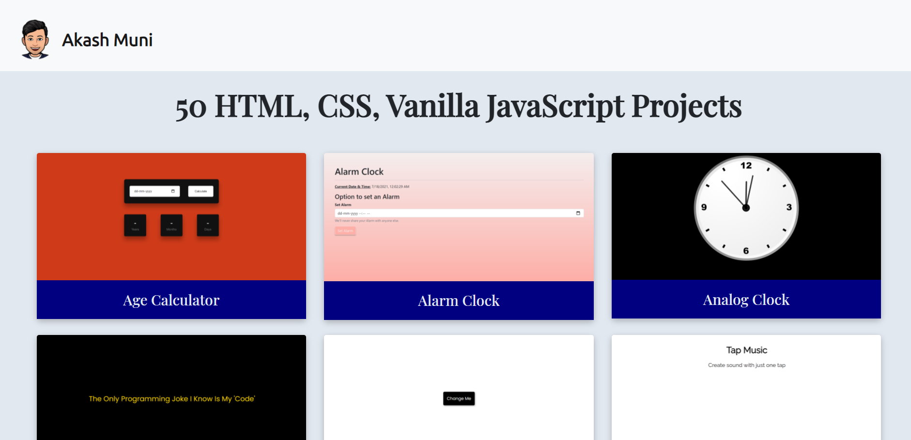

<h1>50 HTML, CSS, Vanilla JavaScript Projects</h1>

<h2>All the projects are built using HTML5, CSS & Vanilla JavaScript.</h2>

<h3>You can find the projects <a href="https://50-html-css-vanillajavascript-projects.netlify.app/" target="_blank">here<a>.</h3>

<ol>
<li>Age-Calculator</li>
<li>Alarm-Clock</li>
<li>Analog-Clock</li>
<li>Auto-Write-Text</li>
<li>Background-Changer</li>
<li>Beatmaker</li>
<li>Calculator-App</li>
<li>Car-Animation</li>
<li>Carousel</li>
<li>Cheatsheet-Template</li>
<li>Color-Flipper</li>
<li>Countdown_Timer</li>
<li>Counter</li>
<li>Cv-Screening</li>
<li>Dark-Mode-Toggle</li>
<li>Drag-and-Drop-project</li>
<li>Dragon-Jump-Game</li>
<li>Drawing-App</li>
<li>Expense-Tracker</li>
<li>Form-Validation</li>
<li>Grocery-List</li>
<li>Hamburger-Button</li>
<li>Heart-Rain</li>
<li>Image-Slider</li>
<li>Library-Website</li>
<li>Lorem-Ipsum-Generator</li>
<li>Master-Notes-App</li>
<li>Master-Quiz-App</li>
<li>Memory-Game</li>
<li>Movie-App</li>
<li>Music-player</li>
<li>News-Website</li>
<li>Notes-App</li>
<li>Password-Generator</li>
<li>Popup</li>
<li>Postman-Clone</li>
<li>Quiz-App</li>
<li>Recipe-App</li>
<li>Rock-Paper-Scissor-Game</li>
<li>Snake-Game</li>
<li>Sound-Board</li>
<li>Stopwatch</li>
<li>Tabs</li>
<li>Team-Members</li>
<li>Tic-tac-toe-game</li>
<li>Toast-Notification</li>
<li>To-Do-App</li>
<li>Wall-Clock</li>
<li>Weather-App</li>
<li>Zoom-Effect</li>
</ol>

<h3>Happy Coding!</h3>
